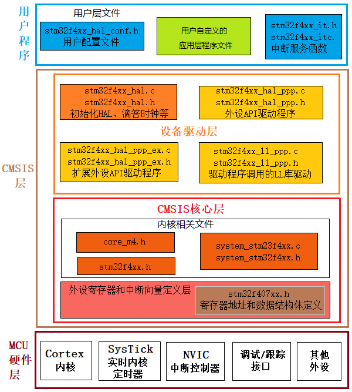
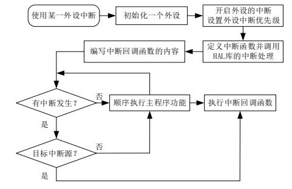

# HAL

- require "HAL-file-structure"

Hardware Abstraction Layer

## CMSIS 标准

软件接口标准化的标准 CMSIS(Cortex Microcon troller Software Interface Standard)

## file tree

- Drivers
  - @BSP
  - @CMSIS
    - @Core
    - @Core_A
    - @Device
      - @stm32f4xx-h
      - @stm32f407xx-h
      - @system_stm32f4xx-h / system_stm32f4xx-c
      - @startup_stm32f407xx-s
    - @DSP
    - @Include
    - @Lib
    - @NN
    - @RTOS
    - @RTOS2
  - @STM32F4xx_HAL_Driver
    - @stm32f4xx_hal-h / stm32f4xx_hal-c
    - @stm32f4xx_hal_conf-h
    - @stm32f4xx_hal_def-h
    - @stm32f4xx_hal_cortex-h / stm32f4xx_hal_cortex-c
    - @stm32f4xx_hal_ppp-h / stm32f4xx_hal_ppp-c
    - @stm32f4xx_hal_ppp_ex-h / stm32f4xx_hal_ppp_ex-c
    - @stm32f4xx_II_ppp-h / stm32f4xx_II_ppp-c
- Middlewares
  - ST
    - @STM32_USB_Device_Library
    - @STM32_USB_Host_Library
    - @STemWin
  - Third_Party
    - @FatFs
    - @FreeRTOS
    - @LibJPEG
    - @LwIP
- @Utilities

?> platformio 的 framework 有这些文件

## API

| 文件名           | stm32f4xx_hal_ppp (c/h)                            | stm32f4xx_hal_ppp_ex (c/h)                             |
| ---------------- | -------------------------------------------------- | ------------------------------------------------------ |
| 函数名           | HAL_PPP_Function   HAL_PPP_FeatureFunction_MODE | HAL_PPPEx_Function   HAL_PPPEx_FeatureFunction_MODE |
| 外设句柄         | PPP_HandleTypedef                                  | -                                                      |
| 初始化参数结构体 | PPP_InitTypeDef                                    | PPP_InitTypeDef                                        |
| 枚举类型         | HAL_PPP_StructnameTypeDef                          | -                                                      |

对于 HAL 的 API 函数,常见的有以下几种:

- 初始化/反初始化函数:HAL_PPP_Init(), HAL_PPP_DeInit()
- 外 设 读 写 函 数 :HAL_PPP_Read(),HAL_PPP_Write(),HAL_PPP_Transmit(), HAL_PPP_Receive()
- 控制函数:HAL_PPP_Set (), HAL_PPP_Get ().
- 状态和错误:HAL_PPP_GetState (), HAL_PPP_GetError ().

### 参数

- 配置和初始化用的结构体:

  一般为 PPP_InitTypeDef 或 PPP_ConfTypeDef 的结构体类型,根据外设的寄存器设计成易于理解和记忆的结构体成员.

- 特殊处理的结构体

  专为不同外设而设置的,带有"Process"的字样,实现一些特异化的中间处理操作等.

- 外设句柄结构体

  HAL 驱动的重要参数,可以同时定义多个句柄结构以支持多外设多模式.HAL 驱动的操作结果也可以通过这个句柄获得.

### 外设操作的宏定义

| Macro Definition                                      | Usage                                                     |
| ----------------------------------------------------- | --------------------------------------------------------- |
| `__HAL_PPP_ENABLE_IT(__HANDLE__, __INTERRUPT__)`      | Enables the specified peripheral interrupt.               |
| `__HAL_PPP_DISABLE_IT(__HANDLE__,__INTERRUPT__)`      | Disables the specified peripheral interrupt.              |
| `__HAL_PPP_GET_IT (__HANDLE__, __INTERRUPT__)`        | Gets the specified peripheral interrupt.                  |
| `__HAL_PPP_CLEAR_IT (__HANDLE__, __INTERRUPT__)`      | Clears the specified peripheral interrupt.                |
| `__HAL_PPP_GET_FLAG (__HANDLE__, __FLAG__)`           | Gets the specified peripheral flag.                       |
| `__HAL_PPP_CLEAR_FLAG (__HANDLE__, __FLAG__)`         | Clears the specified peripheral flag.                     |
| `__HAL_PPP_ENABLE(__HANDLE__)`                        | Enables the specified peripheral.                         |
| `__HAL_PPP_DISABLE(__HANDLE__)`                       | Disables the specified peripheral.                        |
| `__HAL_PPP_XXXX (__HANDLE__, __PARAM__)`              | Performs a special operation on the specified peripheral. |
| `__HAL_PPP_GET_IT_SOURCE (__HANDLE__, __INTERRUPT__)` | Checks the specified peripheral interrupt source.         |

对于 SYSTICK/NVIC/RCC/FLASH/GPIO 这些内核外设或共享资源,不使用
`PPP_HandleTypedef` 这类外设句柄进行控制,如:`HAL_GPIO_Init()`只需要初始化的 GPIO 编号和具体的初始化参数

### 回调函数

| 回调函数                          | 举例                                                                                                                                              |
| --------------------------------- | ------------------------------------------------------------------------------------------------------------------------------------------------- |
| `HAL_PPP_MspInit()` / `_DeInit()` | 举例: `HAL_USART_MspInit()` 由 `HAL_PPP_Init()` 这个 API 调用,主要在这个函数中实现外设对应的 GPIO,时钟,DMA 和中断开启的配置和操作.             |
| `HAL_PPP_ProcessCpltCallback`     | 举例: `HAL_USART_TxCpltCallback` 由外设中断或 DMA 中断调用,调用时 API 内部已经实现中断标记的清除的操作,用户只需要专注于自己的软件功能实现即可. |
| `HAL_PPP_ErrorCallback`           | 举例: `HAL_USART_ErrorCallback` 外设或 DMA 中断中发生的错误,用于作错误处理.                                                                    |

## HAL 库应用程序文件结构

| 类别         | 文件名                                        | 描述                                               | 是否必须 |
| ------------ | --------------------------------------------- | -------------------------------------------------- | -------- |
| 应用程序文件 | main.c                                        | 存放 main 函数,不一定要在这个文件                  | 否       |
|              | main.h                                        | 包含头文件,声明等作用,已删除                       | 否       |
|              | stm32f4xx_it.h/stm32f4xx_it.c                 | 用户中断服务函数存放文件,不一定放到这个文件,可删除 | 否       |
|              | stm32f4xx_hal_conf.h                          | 用户配置文件                                       | 是       |
|              | stm32f4xx_hal_msp.c                           | 回调函数存放文件,已删除                            | 否       |
| 设备驱动层   | sm32f4xx_hal.h/sm32f4xx_hal.c                 | HAL 库的初始化,系统滴答,HAL 库延时函数等功能       | 是       |
|              | stm32f4xx_hal_def.h                           | 通用 HAL 库资源定义                                | 是       |
|              | stm32f4xx_hal_ppp.h/stm32f4xx_hal_ppp.c       | 外设的操作 API 函数文件                            | 是       |
|              | stm32f4xx_hal_ppp_ex.h/stm32f4xx_hal_ppp_ex.c | 拓展外设特性的 API 函数文件                        | 是       |
|              | stm32f4xx_II_ppp.h/stm32f4xx_II_ppp.c         | LL 库文件,在一些复杂外设中实现底层功能             | 是       |
| CMSIS 核心层 | stm32f4xx.h                                   | STM32F4 系列的顶层头文件                           | 是       |
|              | stm32f407xx.h                                 | STM32F407 系列片上外设头文件                       | 是       |
|              | system_stm32f4xx.h/system_stm32f4xx.c         | 主要存放系统初始化函数 SystemInit                  | 是       |
|              | startup_stm32hf407xx.s                        | 启动文件,运行到 main 函数前的准备                  | 是       |
|              | core_cm4.h                                    | 内核寄存器定义,如 Systick,SCB                      | 是       |
|              | cmsis_armcc.h                                 | 内核头文件                                         | 是       |
|              | cmsis_armclang.h                              | 内核头文件                                         | 是       |
|              | cmsis_compiler.h                              | 内核头文件                                         | 是       |
|              | cmsis_version.h                               | 内核头文件                                         | 是       |
|              | mpu_armv7.h                                   | 内核头文件                                         | 是       |

## 用户配置文件 stm32f4xx_hal_conf.h

用于裁剪 HAL 库和定义一些变量

主要内容:

1. HSE_VALUE 表示我们的外部高速晶振的频率
2. LSE_VALUE 外部低速晶振频率
3. 可以屏蔽某些 GPIO 的宏
4. TICK_INT_PRIORITY 滴答定时器的优先级
5. USE_FULL_ASSERT 用于调试

宏定义 TICK_INT_PRIORITY 是滴答定时器的优先级.这个优先级很重要,因为如果其它的外设驱动程序的延时是通过滴答定时器提供的时间基准,来实现延时的话,又由于实现方式是滴答定时器对寄存器进行计数,所以当我们在其它中断服务程序里调用基于此时间基准的延迟函数 HAL_Delay,那么假如该中断的优先级高于滴答定时器的优先级,就会导致滴答定时器中断服务函数一直得不到运行,从而程序卡死在这里.所以滴答定时器的中断优先级一定要比这些中断高.

USE_FULL_ASSERT: 先定义, 然后实现函数 assert_failed

## 弱定义

类似虚函数, 可以重写

## stm32f4xx_hal.c

HAL_Init/HAL_DeInit 调用 HAL_MspInit/HAL_MspDeInit. HAL_MspInit/HAL_MspDeInit 是弱定义, 可以重写

## HAL 库中断处理

设置外设的控制句柄结构体 PPP_HandleType 和初始化 PPP_InitType 结构体的参数,然后调用 HAL 库对应这个驱动的初始化 HAL_PPP_Init(),由于这个 API 中有针对外设初始化细节的接口 Hal_PPP_Mspinit(),我们需要重新实现这个函数并完成外设时钟,IO 等细节差异的设置,完成各细节处理后,使用 HAL_NVIC_SetPriority(),HAL_NVIC_EnableIRQ()来使能我们的外设中断;定义中断处理函数 PPP_IRQHandler,并在中断函数中调用 HAL_ppp_function_IRQHandler()来判断和处理中断标记;HAL 库中断处理完成后,根据对应中的调用我们需要自定义的中断回调接口 HAL_PPP_ProcessCpltCallback();如串口接收函数 HAL_UART_RxCpltCallback(),我们在这个函数中实现我们对串口接收数据想做的处理;中断响应处理完成后,stm32 芯片继续顺序执行我们定义的主程序功能,按照以上处理的标准流程完成了一次中断响应

## 注意事项

1. 即使 HAL 库目前较以前已经相对更完善了, 要有怀疑精神,辩证地去使用好这个工具
2. 尽量使用开发学习时已经测试稳定的 HAL 库
