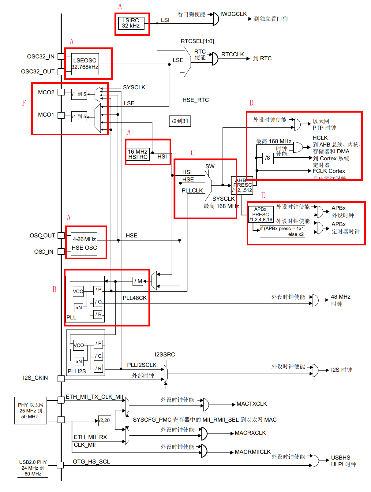

# clock tree

- A. @输入时钟源
- B. 锁相环"PLL";
- C. 系统时钟源选择器,此项决定了 MCU 的系统主时钟"SYSCLK"的大小;AHB 预分频器将 SYSCLK 分频或不分频后分发给其它外设进行处理,包括到 D 部分的 Cortex-M 内核系统的时钟和使能单元
- E 为定时器以及其它外设的时钟源 APB1/APB2.
- F 是 STM32 的 MCO 时钟输出功能

## local

### 输入时钟源

<docs-expose>

可分为外部时钟源和内部时钟源

</docs-expose>

## References

- [STM32MP15 clock tree - stm32mpu](https://wiki.st.com/stm32mpu/wiki/STM32MP15_clock_tree)
