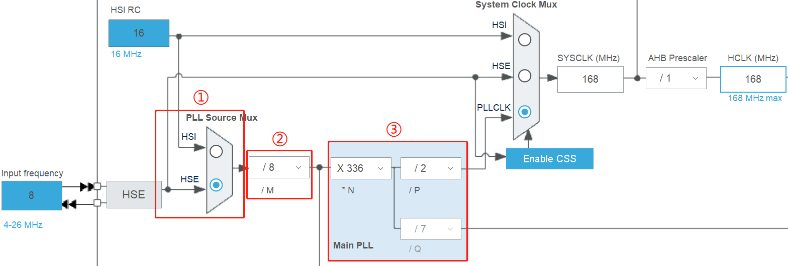
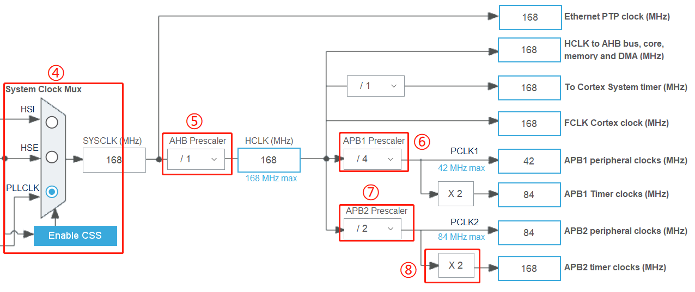
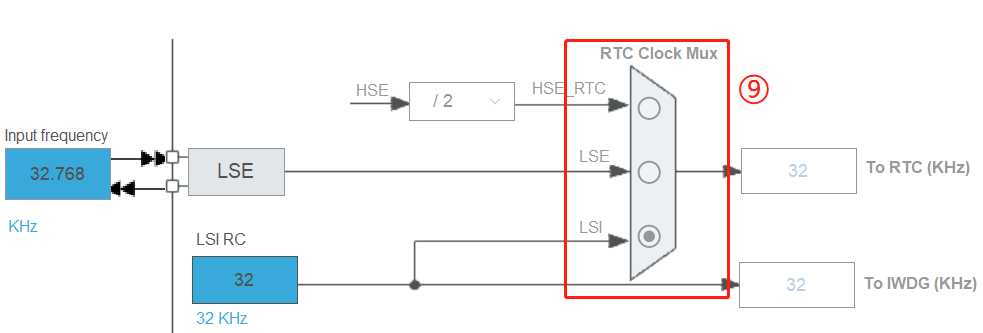
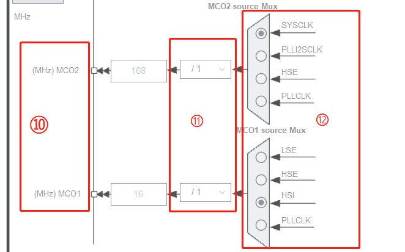

# clock tree

任意复杂的电路控制系统都可以经由门电路组成的组合电路实现.当一个电路越复杂,在达到正确的输出结果前,它可能因为延时会有一些短暂的中间状态,而这些中间状态有时会导致输出结果会有一个短暂的错误,这叫做电路中的"毛刺现象",如果电路需要运行得足够快,那么这些错误状态会被其它电路作为输入采样,最终形成一系列的系统错误.为了解决这个问题,在单片机系统中,设计时以时序电路控制替代纯粹的组合电路,在每一级输出结果前对各个信号进行采样,从而使得电路中某些信号即使出现延时也可以保证各个信号的同步,可以避免电路中发生的"毛刺现象",达到精确控制输出的效果.

- A. 时钟源
- B. 锁相环 PLL
- C. @系统时钟源选择器
- D. Cortex-M 内核系统的时钟和使能单元
- E. 定时器以及其它外设的时钟源 APB1/APB2.
- F. 是 STM32 的 MCO 时钟输出功能

## 时钟源

- 高速外部振荡器 @HSE (High Speed External Clock signal)
- 低速外部振荡器 @LSE (Low Speed External Clock signal)
- 高速内部振荡器 @HSI (High Speed Internal Clock signal)
- 低速内部振荡器 @LSI (Low Speed Internal Clock signal)

芯片上电时默认由内部的 HSI 时钟启动,如果用户进行了硬件和软件的配置,芯片才会根据用户配置调试尝试切换到对应的外部时钟源

## 锁相环 PLL

锁相环是自动控制系统中常用的一个反馈电路,在 STM32 主控中,锁相环的作用主要有两个部分:输入时钟净化和倍频.前者是利用锁相环电路的反馈机制实现,后者我们用于使芯片在更高且频率稳定的时钟下工作.

1. PLL Source Mux:PLL 时钟源选择器
2. PLLM:HSE 分频器作为 PLL 输入 (HSE divider for PLL entry)
3. PLLMUL:PLL 倍频系数 (PLL multiplication factor)

## 系统时钟 SYSCLK

STM32 的系统时钟 SYSCLK 为整个芯片提供了时序信号

- 4. 系统时钟输入源选择
- 5. @AHB 预分频器
- 6. 低速 @APB1 预分频器
- 7. 高速 @APB2 预分频器
- 8. 决定了定时器时钟频率, 由硬件自动设置
- 9. RTC 时钟

## 时钟信号输出 MCO

- 10. MCO 时钟输出, 为外部器件提供时钟
- 11. MCO1/MCO2 时钟分频器
- 12. MCO1/MCO2 时钟源选择器

## 时钟使能和配置

!> 如果使用某些外设,例如 GPIO,ADC 等,要使能这些外设时钟.如果在使用外设之前没有使能外设时钟,外设是不可能正常运行的.

## local

### 系统时钟源选择器

<docs-expose>

此项决定了 MCU 的系统主时钟"SYSCLK"的大小;AHB 预分频器将 SYSCLK 分频或不分频后分发给其它外设进行处理,包括到 D 部分的 Cortex-M 内核系统的时钟和使能单元

</docs-expose>

### HSE

<docs-expose>

外接石英/陶瓷谐振器,频率为 4MHz~26MHz

</docs-expose>

### LSE

<docs-expose>

外接 32.768kHz 石英晶体,主要作用于 RTC 的时钟源.

</docs-expose>

### HSI

<docs-expose>

由内部 RC 振荡器产生,频率为 16MHz

</docs-expose>

### LSI

<docs-expose>

由内部 RC 振荡器产生,频率为 32kHz,可作为独立看门狗的时钟源.

</docs-expose>

### AHB

<docs-expose>

HB 总线时钟直接作为 GPIO(`A\B\C\D\E\F\G\H\I\`),以太网,DCMI,FSMC,AHB 总线,Cortex 内核,存储器和 DMA 的 HCLK 时钟,并作为 Cortex 内核自由运行时钟 FCLK

</docs-expose>

### APB1

<docs-expose>

片上低速的外设就挂载在该总线上,例如有看门狗定时器,定时器 2/3/4/5/6/7,RTC 时钟,USART2/3/4/5,SPI2(I2S2)与 SPI(I2S3),I2C1~3,CAN 和 2 个 DAC

</docs-expose>

### APB2

<docs-expose>

外设有定时器 1/8/9/10/11,SPI1,USART1 和 USART6,3 个 ADC 和 SDIO 接口

</docs-expose>

## References

- [STM32MP15 clock tree - stm32mpu](https://wiki.st.com/stm32mpu/wiki/STM32MP15_clock_tree)
