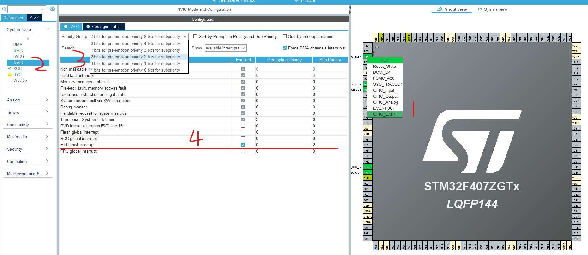
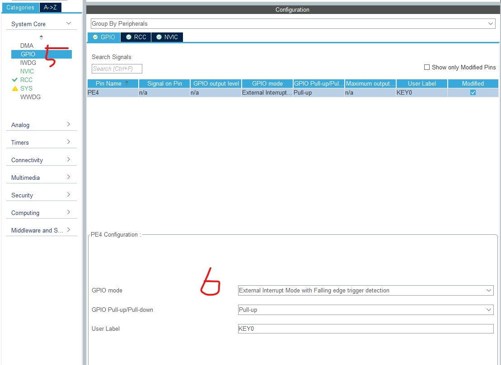

# interrupt

## NVIC

NVIC 即嵌套向量中断控制器,全称 Nested vectored interrupt controller

- @ISER
- @ICER
- @ISPR
- @ICPR
- @IABR
- @IP

## 中断优先级

- 抢占优先级:抢占优先级高的中断可以打断正在执行的抢占优先级低的中断
- 响应优先级:抢占优先级相同,响应优先级高的中断不能打断响应优先级低的中断

## EXTI

EXTI 支持 23 个外部中断/事件请求

- EXTI 线 0~15:对应外部 IO 口的输入中断
- EXTI 线 16:连接到 PVD 输出
- EXTI 线 17:连接到 RTC 闹钟事件
- EXTI 线 18:连接到 USB 唤醒事件
- EXTI 线 19:连接到以太网唤醒事件
- EXTI 线 20:连接到 USB OTG HS(在 FS 中配置)唤醒事件
- EXTI 线 21:连接到 RTC 入侵和时间戳事件
- EXTI 线 22:连接到 RTC 唤醒事件

?> STM32 把 GPIO 管脚 GPIOx.0-GPIOx.15(x=A,B,C,D,E,F,G)分别对应中断线 0-15.这样子每个中断线对应了最多 7 个 IO 口

以线 0 为例:它对应了 GPIOA.0,GPIOB.0,GPIOC.0,GPIOD.0,GPIOE.0,GPIOF.0 和 GPIOG.0.而中断线每次只能连接到 1 个 IO 口上,需要通过配置决定对应的中断线配置到哪个 GPIO 上

## STM32CubeMX



1. pin 选择输出类型
2. NVIC 配置
3. Priority Group: 建议界面拉宽一点, 方便看清楚
4. 设置中断的优先级
5. GPIO 配置



## local

```c
void HAL_NVIC_SetPriorityGrouping(uint32_t PriorityGroup);
```

用于设置中断优先级分组.

- 形参 1 是中断优先级分组号,可以选择范围:NVIC_PRIORITYGROUP_0 到
  NVIC_PRIORITYGROUP_4(共 5 组).

!> 这个函数在一个工程里基本只调用一次,而且是在程序 HAL 库初始化函数里面已经被调用,后续就不会再调用了.因为当后续调用设置成不同的中断优先级分组时,有可能造成前面设置好的抢占优先级和响应优先级不匹配.

```c
void HAL_NVIC_SetPriority(IRQn_Type IRQn, uint32_t PreemptPriority,uint32_t SubPriority);
```

用于设置中断的抢占优先级和响应优先级(子优先级).

- 形参 1 是中断号,可以选择范围:IRQn_Type 定义的枚举类型,定义在 stm32f407xx.h.
- 形参 2 是抢占优先级,可以选择范围:0 到 15.
- 形参 3 是响应优先级,可以选择范围:0 到 15.

```c
void HAL_NVIC_EnableIRQ(IRQn_Type IRQn);
```

用于使能中断.

- 形参 1 是中断号,可以选择范围:IRQn_Type 定义的枚举类型,定义在 stm32f407xx.h.

```c
void HAL_NVIC_DisableIRQ(IRQn_Type IRQn);
```

用于中断除能.

```c
void HAL_NVIC_SystemReset(void);
```

用于软件复位系统.

### ISER

<docs-expose>

ISER 全称是:Interrupt Set Enable Registers,这是一个中断使能寄存器组

256 个中断,这里用 8 个 32 位寄存器来控制,每个位控制一个中断

`8*32=256`, 每个位设置使能

</docs-expose>

### ICER

<docs-expose>

ICER 全称是:Interrupt Clear Enable Registers,这是一个中断清除使能寄存器组

!> 这里要专门设置一个 ICER 来清除中断位,而不是向 ISER 写 0 来清除,是因为 NVIC 的这些寄存器都是写 1 有效的,写 0 是无效的

</docs-expose>

### ISPR

<docs-expose>

全称是:Interrupt Set Pending Registers,是一个中断使能挂起控制寄存器组

通过置 1,可以将正在进行的中断挂起,而执行同级或更高
级别的中断.写 0 是无效的.

</docs-expose>

### ICPR

<docs-expose>

全称是:Interrupt Clear Pending Registers,是一个中断解挂控制寄存器组

其作用与 ISPR 相反,对应位也和 ISER 是一样的.通过设置 1,可以将挂起的中断解挂.写 0 无效.

</docs-expose>

### IABR

<docs-expose>

全称是:Interrupt Active Bit Registers,是一个中断激活标志位寄存器组

对应位所代表的中断和 ISER 一样,如果为 1,则表示该位所对应的中断正在被执行.这是一个只读寄存器,通过它可以知道当前在执行的中断是哪一个.在中断执行完了由硬件自动清零.

</docs-expose>

### IP

<docs-expose>

全称是:Interrupt Priority Registers,是一个中断优先级控制的寄存器组

</docs-expose>

## References

- [How to use GPIO Interrupts in STM32F4 CubeMX - Thecodeprogram](https://thecodeprogram.com/how-to-use-gpio-interrupts-in-stm32f4-cubemx)
- [STM32CubeMX GPIO Interrupts Tutorial](https://www.youtube.com/watch?v=8QYjZKQJK6w)
